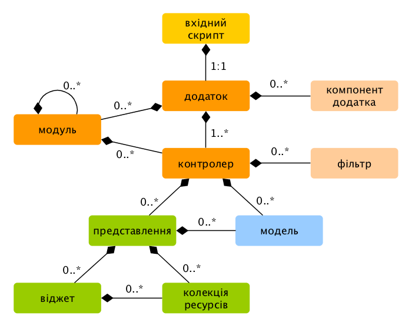

Виконання додатків
==================

Після встановлення Yii, базовий додаток буде доступний або по URL `http://hostname/basic/web/index.php`,
або по `http://hostname/index.php`, в залежності від налаштування веб-сервера. Даний розділ - загальне введення в
організацію коду, вбудований функціонал і опрацювання запитів додатком Yii.

> Інформація: Для спрощення, далі в даному посібнику припускається, що Yii встановлений в директорію `basic/web`,
  яка, в свою чергу, встановлена, як коренева директорія в налаштуваннях веб-сервера. В результаті, звернувшись до URL
  на зразок `http://hostname/index.php`, ви отримаєте доступ до додатку.
  Будь ласка, відредагуйте URL-адреси наведені у прикладах відповідно до ваших потреб.


Функціонал <span id="functionality"></span>
----------

Встановлений базовий додаток складається з чотирьох сторінок:

* домашня сторінка, відображається при переході по URL `http://hostname/index.php`;
* сторінка "About" ("Про нас");
* сторінка "Contact", що відображає форму зворотнього зв’язку, за допомогою якої користувач може звернутися до розробника по e-mail;
* сторінка "Login", на якій відображається форма для аутентифікації користувачів. Спробуйте увійти з логіном/паролем
  "admin/admin". Зверніть увагу на зміну пункту "Login" в головному меню на "Logout".

Ці сторінки використовують спільну шапку і футер. Шапка містить головне меню, за
допомогою якого здійснюється навігація по сайту.

У нижній частині вікна ви зможете бачити системні повідомлення Yii - налагоджувальну інформацію,
повідомлення про помилки, запити до бази даних і т. п. Відображенням даної інформацію керує
[вбудований відладчик](https://github.com/yiisoft/yii2-debug/blob/master/docs/guide-uk/README.md), він записує і відображає інформацію про хід виконання додатку.

Крім веб-додатка, існує консольний скрипт `yii`, що розташований в базовій директорії додатка.
Цей скрипт може бути використаний для виконання фонових завдань або завдань обслуговування додатка.
Все це описано у розділі [Консольні команди](tutorial-console.md).


Структура додатка Yii <span id="application-structure"></span>
---------------------

Нижче наведений перелік основних директорій і файлів вашого додатку (вважаємо, що додаток встановлений в директорію `basic`):

```
basic/                  базова директорія додатка
    composer.json       використовується Composer'ом, містить опис додатку
    config/             містить конфігураційні файли
        console.php     конфігурація консольного додатка
        web.php         конфігурація веб-додатка
    commands/           містить класи консольних команд
    controllers/        містить класи контролерів
    models/             містить класи моделей
    runtime/            містить файли, які генерує Yii під час виконання додатку (журнали, кеш і т. п.)
    vendor/             містить пакунки Composer'а і, власне, сам фреймворк Yii
    views/              містить представлення додатку
    web/                базова веб-директорія, містить файли, доступні через Web
        assets/         містить файли ресурсів (javascript та css)
        index.php       вхідний (або bootsrap) скрипт для додатку Yii, з нього розпочинається виконання додатку
    yii                 скрипт виконання консольних команд Yii
```

В цілому, додаток Yii можна розділити на дві категорії файлів: розміщенні в `basic/web` і розміщенні в інших директоріях.
Перша категорія доступна через HTTP (наприклад, браузером), друга недоступна зовні, та і не повинна бути, оскільки містить службову інформацію.

В Yii реалізований шаблон проектування [модель-представлення-контролер (MVC)](http://uk.wikipedia.org/wiki/Model-View-Controller),
що відображається на вищезазначеній структурі директорій додатка. В директорії `models` знаходяться всі класи [моделей](structure-models.md),
у `views` розміщені всі скрипти [представлень](structure-views.md), а в директорії `controllers`
всі класи [контролерів](structure-controllers.md) додатка.

Діаграма нижче демонструє статичну структуру додатка.



В кожному додатку Yii є місце входження в додаток, `web/index.php` - це єдиний PHP-скрипт доступний для виконання через Web.
Він отримує вхідний запит і створює екземпляр [додатку](structure-applications.md).
[Додаток](structure-applications.md) опрацьовує запит з допомогою його [компонентів](concept-components.md)
і відправляє запит елементам MVC. [Віджети](structure-widgets.md) використовуються у [представленнях](structure-views.md)
для побудови складних та динамічних елементів інтерфейсу користувача.


Життєвий цикл запиту <span id="request-lifecycle"></span>
--------------------

На діаграмі показано, як додаток відпрацьовує запит.


1. Користувач робить запит до [вхідного скрипту](structure-entry-scripts.md) `web/index.php`.
2. Вхідний скрипт завантажує [конфігурацію](concept-configurations.md) додатка та створює екземпляр
   [додатку](structure-applications.md) для наступного опрацювання запиту.
3. Додаток визначає [маршрут](runtime-routing.md) запиту за допомогою компонента [запиту](runtime-requests.md) додатка.
4. Додаток створює екземпляр [контролера](structure-controllers.md) для виконання запиту.
5. Контролер, в свою чергу, створює [дію](structure-controllers.md) і накладає на неї фільтри.
6. Якщо хоч один фільтр поверне помилку - виконання додатку зупиняється.
7. Якщо всі фільтри пройдені - додаток виконується.
8. Дія завантажує модель даних, скоріше за все із бази даних.
9. Дія формує представлення та відображає в ньому дані (в т. ч. і отримані із моделі).
10. Сформований результат передається компоненту [відповіді](runtime-responses.md) додатка.
11. Компонент "відповіді" відправляє готовий результат роботи додатка браузеру користувача.
